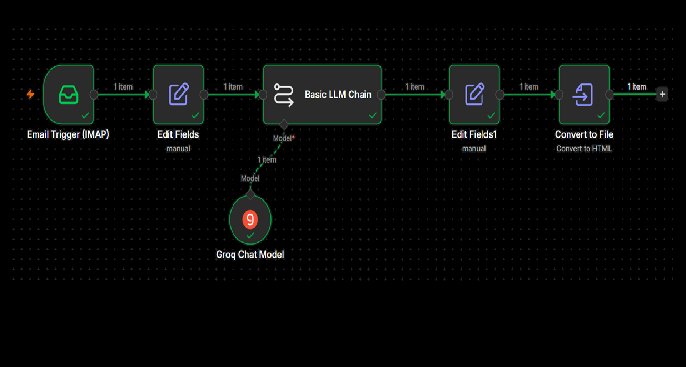

#  Email Summarizer using n8n
 
An automated email summarization workflow built with **n8n** that monitors your inbox via IMAP, processes incoming emails through an AI language model (Groq), and converts the summary into a clean HTML file — all without writing a single line of code.
 
---
 
##  Features
 
- **Automatic Email Monitoring** — Triggers instantly when a new email arrives via IMAP
- **AI-Powered Summarization** — Uses Groq's LLM to generate concise, readable summaries
- **HTML Output** — Converts the AI summary into a formatted HTML file for easy viewing or sharing
- **Fully Automated** — End-to-end pipeline with zero manual intervention after setup
- **Low-Code** — Built entirely on n8n's visual workflow editor
---

### Node Breakdown
 
| Node | Type | Purpose |
|------|------|---------|
| **Email Trigger (IMAP)** | Trigger | Listens for new emails in your inbox |
| **Edit Fields** | Transform | Extracts relevant fields (subject, body, sender) from the raw email |
| **Basic LLM Chain** | AI | Sends the email content to the language model with a summarization prompt |
| **Groq Chat Model** | AI Sub-node | The actual LLM powering the chain (connected as the model provider) |
| **Edit Fields1** | Transform | Cleans and structures the LLM's response |
| **Convert to File** | Output | Converts the final summary into an `.html` file |
 
---

 ##  How It Works
 
1. A new email lands in your inbox
2. The **IMAP trigger** fires and picks up the email metadata and body
3. **Edit Fields** extracts the subject, sender, and email body
4. The **Basic LLM Chain** sends a prompt to the **Groq Chat Model** asking it to summarize the email
5. **Edit Fields1** formats the summary response
6. **Convert to File** packages the summary as an HTML file, ready for download, storage, or further processing
---

 ##  Tech Stack
 
| Tool | Role |
|------|------|
| [n8n](https://n8n.io) | Workflow automation platform |
| [Groq](https://groq.com) | Ultra-fast LLM inference API |
| IMAP | Email protocol for inbox monitoring |
 
---

##  Workflow Screenshot
 

 
> The workflow runs on n8n's visual editor with 5 connected nodes and a Groq Chat Model sub-node powering the AI chain.
 
---
